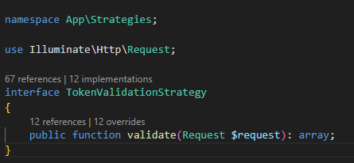
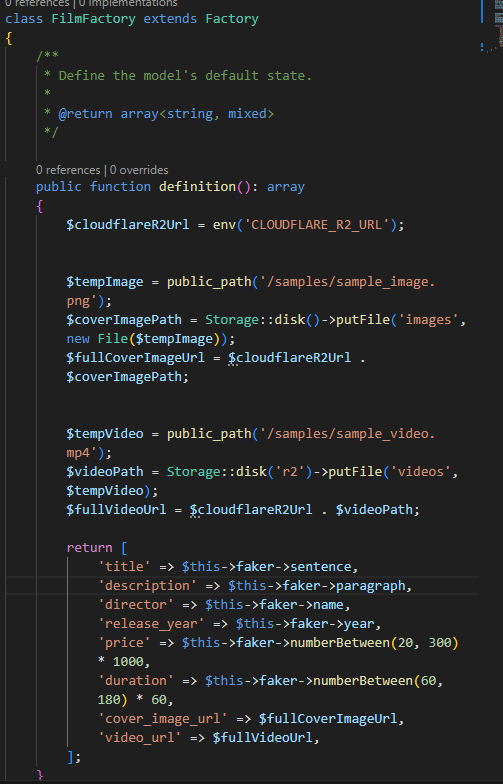
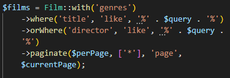
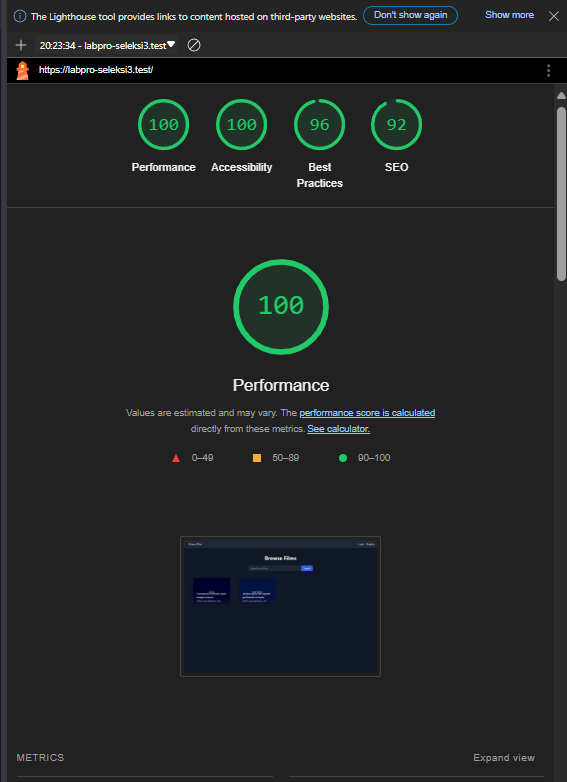
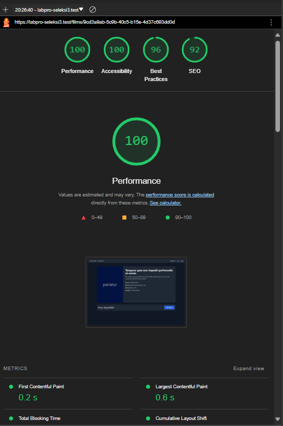
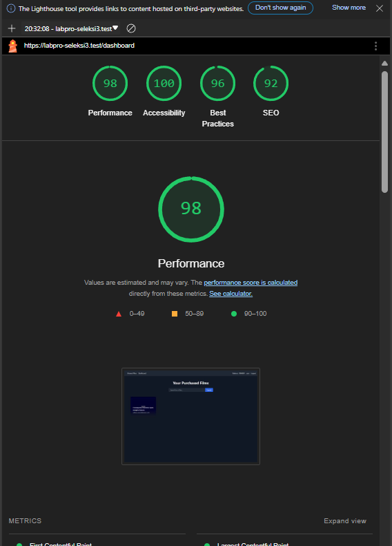
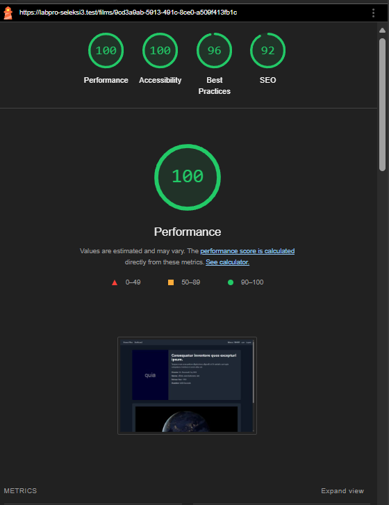
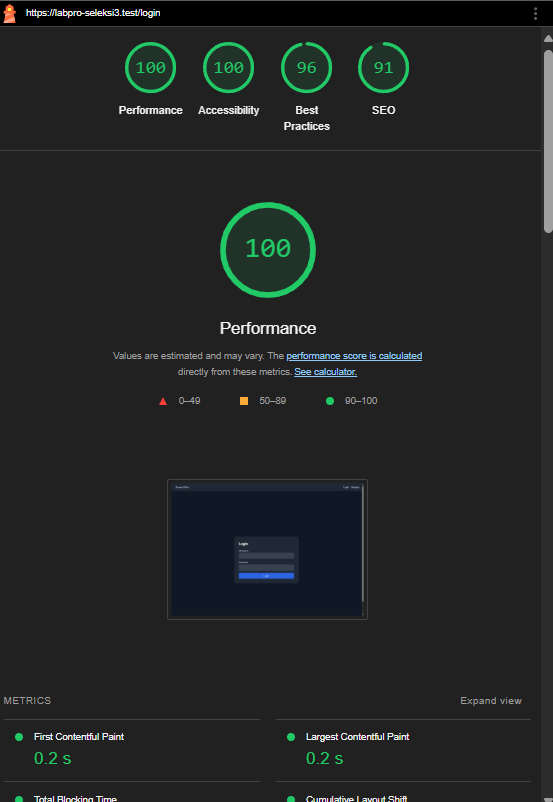
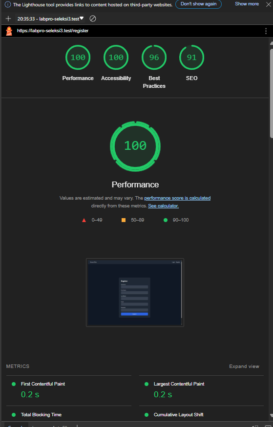

## Author

| Name           | NIM      |
| -------------- | -------- |
| Rayhan Fadhlan | 13522095 |


## Cara menjalankan

pastikan docker sudah terinstall di desktop

1. ubah .env.example menjadi .env, lalu masukkan credentials cloudflare r2

2. jalankan
```bash
docker compose build
docker compose up 
```
3. jika ingin melakukan seeding ke database, jalankan
```bash
docker compose exec php php artisan db:seed
```
4. Website monolith dapat dibuka di
localhost:8000 
atau
127.0.0.1:8000

API endpoint dapat diakses pada
localhost:8000/api
atau
127.0.0.1:8000/api

## Design pattern

beberapa design pattern yang saya gunakan adalah

1. Strategy design pattern

Strategy design pattern saya gunakan dalam mengelompokkan algoritma dengan fungsi yang sama, yaitu dalam memvalidasi token authentication. Strategi pertama digunakan untuk memvalidasi token yang didapat dari cookies, strategi ini digunakan di website monolith karena token yang diberikan disimpan pada cookies. Strategi yang kedua digunakan untuk memvalidasi token yang disimpan pada header request di yang digunakan di REST API.

   


2. Factory method design pattern

Factory method design pattern saya gunakan dalam membuat factory masing-masing faker model yang nantinya dipakai dalam proses seeding database.




3. Builder design pattern

Builder design pattern saya gunakan saat membuat query pada beberapa controller. Design pattern ini tidak diimplementasikan secara langsung, namun sudah tersedia dari ORM pada laravel. salah satu contoh penggunaan design pattern ini adalah pada pembuatan query pencarian film, dimana query ini dilakukan secara step-by-step.




## Teknologi yang digunakan

Website ini dibangun menggunakan bahasa PHP dengan framework Laravel. PHP yang digunakan versi 8.3.8 dan Laravel yang digunakan versi 11.21.0. 

- PHP ver. 8.3.8
- Laravel ver. 11.21.0
- Blade template engine
- Eloquent ORM
- Tailwind CSS
- MySQL Database
- Docker ver. 26.1.1


## Endpoint yang dibuat

### POST /films
**Request:**
- **Header:**
  - `Content-Type: multipart/form-data`
  - `Authorization: Bearer <token>`
- **Body:**
  - `title: string`
  - `description: string`
  - `director: string`
  - `release_year: number`
  - `genre: string[]`
  - `price: number`
  - `duration: number` (dalam detik)
  - `video: <binary video file>`
  - `cover_image: <binary image file> | null`

**Response:**
```json
{
    "status": "success" | "error",
    "message": "string",
    "data": {
        "id": "string",
        "title": "string",
        "description": "string",
        "director": "string",
        "release_year": "number",
        "genre": "string[]",
        "price": "number",
        "duration": "number",
        "video_url": "string",
        "cover_image_url": "string | null",
        "created_at": "string",
        "updated_at": "string"
    } | null
}
```
### GET /films
**Request:**
- **Header:**
  - `Authorization: Bearer <token>`
- **Query:**
    q: string (search berdasarkan title dan director)
**Response:**
```json
{
    "status": "success" | "error",
    "message": "string",
    "data": [
        {
            "id": "string",
            "title": "string",
            "director": "string",
            "release_year": "number",
            "genre": "string[]",
            "price": "number",
            "duration": "number",
            "cover_image_url": "string | null",
            "created_at": "string",
            "updated_at": "string"
        }
    ] | null
}
```
**GET /films/:id**
**Request:**
- **Header:**
  - `Authorization: Bearer <token>`
**Response:**
```json
{
    "status": "success" | "error",
    "message": "string",
    "data": {
        "id": "string",
        "title": "string",
        "description": "string",
        "director": "string",
        "release_year": "number",
        "genre": "string[]",
        "price": "number",
        "duration": "number",
        "video_url": "string",
        "cover_image_url": "string | null",
        "created_at": "string",
        "updated_at": "string"
    } | null
}
```

### **PUT /films/:id**
**Request:**

- **Header:**
  - `Content-Type: multipart/form-data`
  - `Authorization: Bearer <token>`
- **Body:**
  - `title: string`
  - `description: string`
  - `director: string`
  - `release_year: number`
  - `genre: string[]`
  - `price: number`
  - `duration: number` (dalam detik)
  - `video: <binary video file> | null` (jika null artinya tidak berubah)
  - `cover_image: <binary image file> | null` (jika null artinya tidak berubah)

  **Response**:
```json
{
    "status": "success" | "error",
    "message": "string",
    "data": {
        "id": "string",
        "title": "string",
        "description": "string",
        "director": "string",
        "release_year": "number",
        "genre": "string[]",
        "price": "number",
        "duration": "number",
        "video_url": "string",
        "cover_image_url": "string | null",
        "created_at": "string",
        "updated_at": "string"
    } | null
}
```

### **DELETE /films/:id**
**Request:**

- **Header:**
  - `Authorization: Bearer <token>`

**Response:**
```json
{
    "status": "success" | "error",
    "message": "string",
    "data": {
        "id": "string",
        "title": "string",
        "description": "string",
        "director": "string",
        "release_year": "number",
        "genre": "string[]",
        "video_url": "string",
        "created_at": "string",
        "updated_at": "string"
    } | null
}
```

### **POST /login**
**Request:**

- **Body:**
  - `username: string`
  - `password: string`

**Response:**
```json
{
    "status": "success" | "error",
    "message": "string",
    "data": {
        "username": "string",
        "token": "string"
    } | null
}
```

### **GET /self**
**Request:**

- **Header:**
  - `Authorization: Bearer <token>`

**Response:**
```json
{
    "status": "success" | "error",
    "message": "string",
    "data": {
        "username": "string",
        "token": "string"
    } | null
}
```

### **GET /users**
**Request:**

- **Header:**
  - `Authorization: Bearer <token>`
- **Query:**
  - `q: string` (search berdasarkan username)

**Response:**
```json
{
    "status": "success" | "error",
    "message": "string",
    "data": [
        {
            "id": "string",
            "username": "string",
            "email": "string",
            "balance": "integer"
        }
    ] | null
}
```
### **GET /users/:id**
**Request:**

- **Header:**
  - `Authorization: Bearer <token>`

**Response:**
```json
{
    "status": "success" | "error",
    "message": "string",
    "data": {
        "id": "string",
        "username": "string",
        "email": "string",
        "balance": "integer"
    } | null
}
```
### **POST /users/:id/balance**
**Request:**

- **Header:**
  - `Authorization: Bearer <token>`
- **Body:**
  - `increment: int`

**Response:**
```json
{
    "status": "success" | "error",
    "message": "string",
    "data": {
        "id": "string",
        "username": "string",
        "email": "string",
        "balance": "integer"
    } | null
}
```

### **DELETE /users/:id**
**Request:**

- **Header:**
  - `Authorization: Bearer <token>`

**Response:**
```json
{
    "status": "success" | "error",
    "message": "string",
    "data": {
        "id": "string",
        "username": "string",
        "email": "string",
        "balance": "integer"
    } | null
}
```

## Bonus
### B03 - Polling
Sistem polling dibuat pada halaman browse films, ketika admin menambahkan film, maka user yang sedang membuka page tersebut dapat langsung melihat film yang baru tanpa melakukan refresh. Data diambil setiap 5 detik

### B05 - Lighthouse

- Browse page


- Detail film page


- Dashboard page


- Watch film page


- Login page


- Register page


### B06 - Responsive Layout
Layout responsive baik pada mobile maupun desktop di seluruh page

### B07 - Dokumentasi api
Dokumentasi API dibuat menggunakan swagger dan dapat diakses pada 
```
localhost:8000/api/documentation
```

### B11 - Ember
Implementasi Bucket menggunakan cloudflare R2 untuk menyimpan image cover film serta video film.
